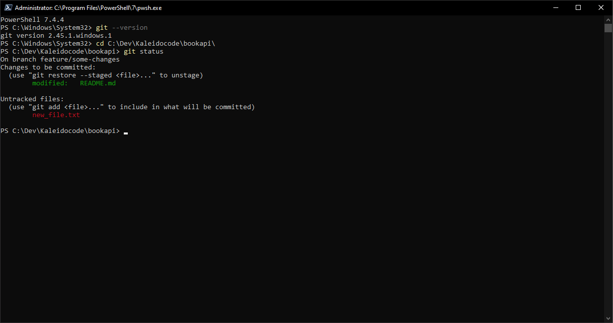
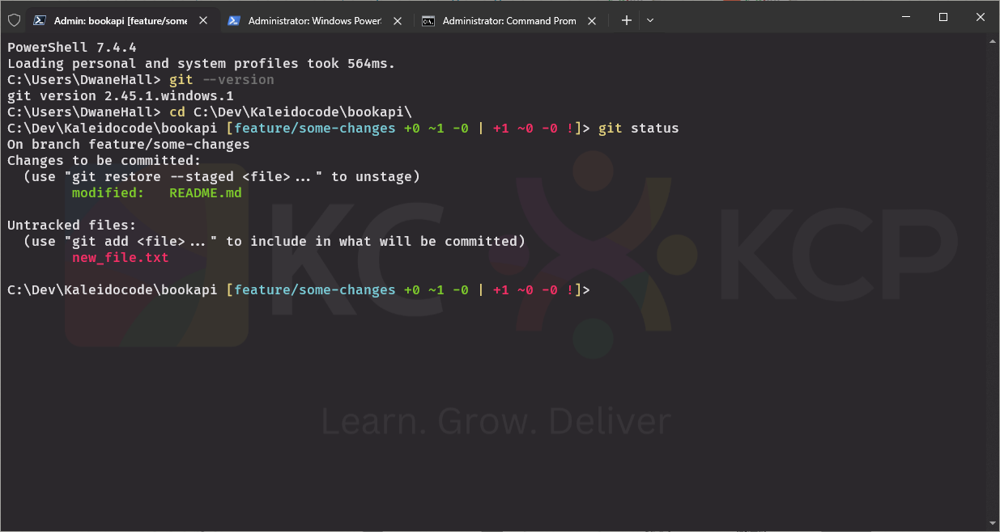
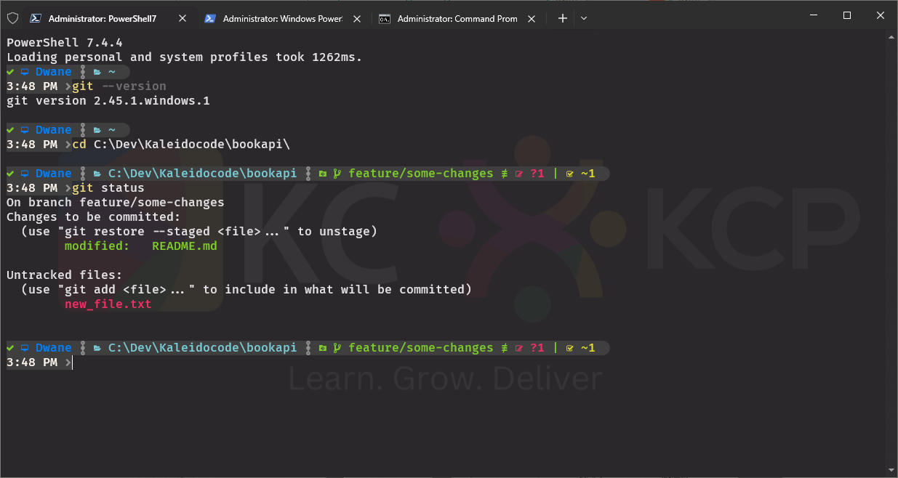

# Installing & Configuring Git:

[Official git webpage](https://git-scm.com)

I recommend a mostly default installation with just the following changes:
- `Choosing the default editor used by Git`: make sure to select the editor you like from the drop down menu.
- `Adjusting the name of the initial branch in new repositories`: set to override and leave it as `main`, this is inline with GitHub.
- `Adjusting your PATH environment`: use the recommended so we can use git from powershell and cmd.

Verification Check: Open a new Terminal window and check your Git installation and version using `git --version`.
Now you should complete your user set up with the following commands:
- `git config --global user.name "Your Name"`
- `git config --global user.email "youremail@email.com"`
- To confirm check this with `git config --global --list`

### Additional Recommended Programs:
- [PowerShell 7](https://learn.microsoft.com/en-us/powershell/scripting/install/installing-powershell-on-windows?view=powershell-7.4#installing-the-msi-package) (Also available in Microsoft Store) - Powerful CLI for Windows 
- [Windows Terminal](https://learn.microsoft.com/en-us/windows/terminal/install) (Also available in Microsoft Store) - CLI Tool for the modern age
- [PoshGit](https://github.com/dahlbyk/posh-git) - Adds git info and autocomplete to CLI
- [Oh-My-Posh](https://ohmyposh.dev/docs/installation/windows) - CLI customizer

VS Code Users: Install and activate Git extension in VS Code `Git Essentials`

### Images of above programs:

PoweShell 7:  
<kbd></kbd>

Terminal + PoshGit:  
<kbd></kbd>

Terminal + Oh-My-Posh:  
<kbd></kbd>