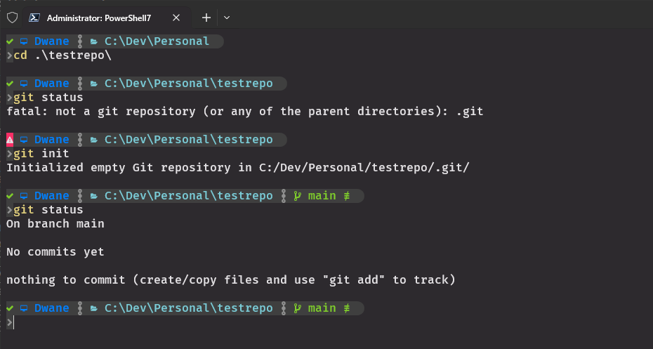
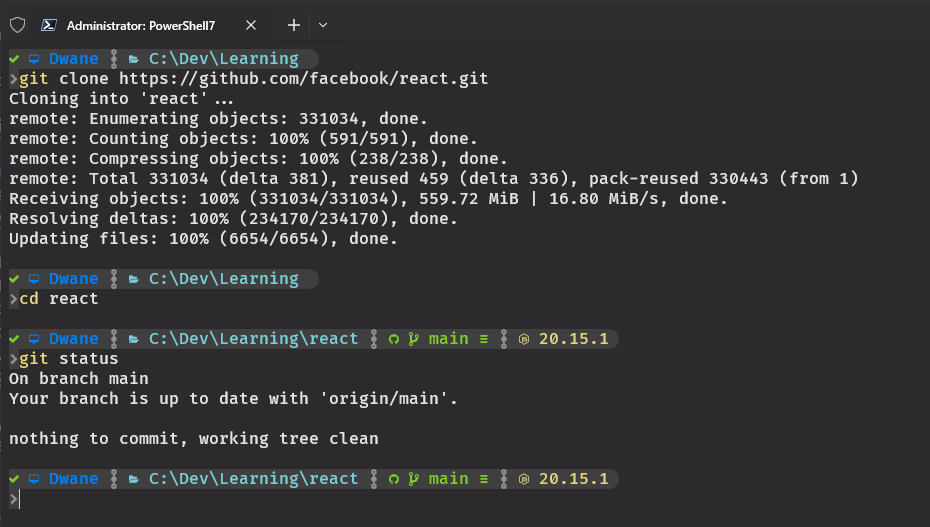

# Creating and Cloning Repositories:

### Check First:
Once you have prepared a new folder for your repo always run a check with `git status`

`git status`
- Gives you the current folders repo information
- This also works regardless of how deep your folder is inside a git repo
- Always use this before making a repo to ensure you are not already inside a repo
- If you are not in a repo you will get `fatal: not a git repository (or any of the parent directories): .git`

### Local Repo Creation:
`git init`
- Will start tracking the current folder and all children folders/files as a new repo
- Confirmation from terminal `Initialized empty Git repository in C:/Dev/Personal/testrepo/.git/`
- `git init <Directory>` - Specify a directory to initialize a repo  

<kbd></kbd>

### Create an empty repository on GitHub:
- Head to your GitHub profile, select Repositories, then select New  
<kbd></kbd>

- Leave template and Owner at default
- Repository name should be the name of your project
- Public or Private depends on the type of project
- The README, .gitignore, and license are optional, selecting any of them will create a repo with a commit that includes the specified files. We will look into the .gitignore file later  
<kbd></kbd>

- The GitHub repo will give you some recommendations on how to use this blank repo or link a local repo  
<kbd></kbd>

### Cloning Existing Repo:
- Most public repos allow you to clone or fork a repo to your local computer
- On the repo page click the `<> Code` drop down
<kbd></kbd>

- Copy the https url for the repo (or ssh if you have an ssh set up)
- In your terminal go to the parent folder that will hold the repo: `C:\Dev\VC\`
- `git clone <URL>` will clone the repo into a new folder with the repo name
- `cd <RepoName>` to move into the repo folder  
<kbd></kbd>

### Remote vs Local:
- Remotes are references to remote repositories hosted on servers like GitHub (Others are Azure, GitLab, BitBucket, and more...).
- Remotes allow you to collaborate with others and share your code changes.
- The remote repo will be the main source for everyone working on the project, it will be the `origin` repo
- Repos on your local computer (initialialized or cloned) allow you to work on the repo in your own capacity even in offline mode
- Changes made to your local do not auto update the remote, the same is true for the other way round  

<kbd></kbd>