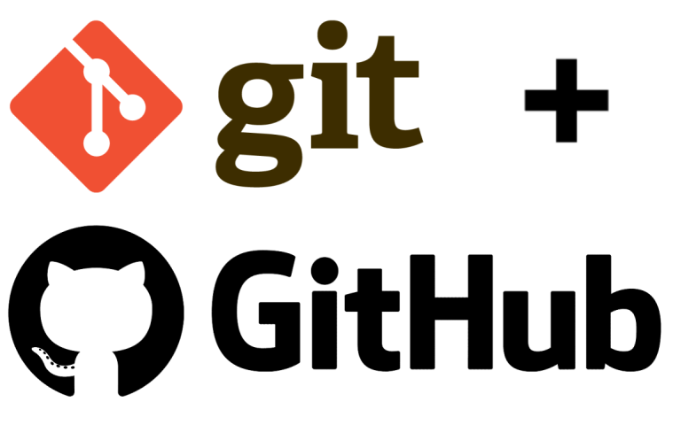

# Overview:

<kbd></kbd>

This lesson covers the basics of Git and GitHub, two crucial tools in the software development ecosystem, helping you manage your code effectively and collaborate with other developers on team projects.  
Have you ever:
- Made a change to code, realised it was a mistake and wanted to revert back?
- Had to maintain multiple versions of a product?
- Wanted to see the difference between two (or more) versions of your code?
- Wanted to review the history of some code?
- Wanted to share your code, or let other people work on your code?  

Then let's introduce:

# Git!

Git is a version control tool used for tracking changes in source code and other files. It is the worlds most popular version control tool.  
Widely used in software development, Git helps teams manage and coordinate their work efficiently. Git is also used in tech adjacent roles.  
Git allows you to work decentralized, meaning all work is done locally, multiple people can work on the same code simultaneously without overriding each other's work.  
Git keeps a complete history of all changes made to the files it is tracking, allowing you to revert to previous versions.  

<kbd></kbd>

### Then what is GitHub?

Git and GitHub are closely related but are not the same thing.  
GitHub is a web-based platform that hosts Git projects (think Dropbox for devs), enabling developers to collaborate on projects by sharing and managing code online.  
It provides tools for code review (Pull Requests), issue tracking, and continuous integration (GitHub Actions), making it easier for teams to work together.  
GitHub also offers a social aspect, allowing users to follow projects, contribute to open-source software, and showcase their work.  
GitHub is used for both open-source and private projects, serving as a central hub for code collaboration and project management.

---

## Why Learn Git?

As developers, our daily routine revolves around reading, writing, and reviewing code. Git is arguably one of the most important tools we use. Mastering the features and functionalities Git offers is one of the best investments you can make in yourself as a developer.