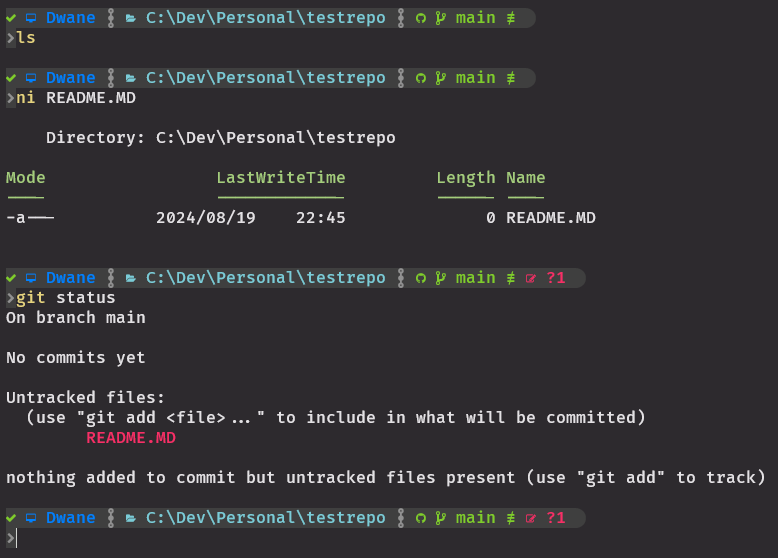

# Files and Stages:

Use **`git status`** often!

### Untracked Files:
Files in your working directory that are not yet being tracked by Git. This means Git is not keeping an eye on changes to these files.  
When you create a new file in your repo directory, Git doesn’t automatically start tracking it but it will show you that it is untracked. It’s considered "untracked" until you tell Git to track it.  
<kbd></kbd>

### Un-Staged Files:
Untracked and Tracked files that have been changed but are not yet staged for the next commit. These files have been modified in your working directory, but Git is not ready to include these changes in the next commit until you explicitly stage them.

### Staging and Staged Files:
To move new (untracked files) or modified (tracked) files into the staging area to be tracked in the next commit we use the command `git add`:
- `git add <file>` to add new files or to accept all changes of a tracked file.
- `git add -p` to add modified pieces of tracked files.

After using `git add`, the file is staged, meaning it’s ready to be committed to the repo.  
<kbd></kbd>

### Unstaging Files:
If you notice in `git status` that one of the staged files should not be commited there is a way to unstage.  
`git restore --staged <filename>`  
Note that if you have no commits the command is instead `git rm --cached <file>`  
This will remove the new or modified file from staging.  
<kbd></kbd>

### Ignoring Files:
There could be many reasons to ignore certain files in your repo, generally it is to not keep a tracked history of unneeded or security related files:
- Dependency files
- Binary files
- Video files
- Secret related documents

The `.gitignore` file added to your repo helps Git understand what files not to track.  
When creating the repo on github earlier they offered a .gitignore file that could be tailored to your project.  
File and folder names within the .gitignore will not be tracked, more info from [Git Documentation](https://git-scm.com/docs/gitignore) and [GitHub Templates](https://github.com/github/gitignore).  
<kbd></kbd>

### Committing Files/Changes:
The action of saving your staged changes to the repo history.  
This creates a snapshot of your project at that point in time.  
Use `git commit -m "Message explaining the file changes"` to save those changes to the repo.  
Addittionaly you can create a more descriptive commit with a second `-m`: `git commit -m "Brief message" -m "Detailed message"`  
<kbd></kbd>  

It is important to write clear and concise commit messages for yourself and other team members. [Git committing good practices](https://www.freecodecamp.org/news/how-to-write-better-git-commit-messages/).  
Commits should be "Atomic": An atomic commit is a commit that contains a single, complete, and coherent unit of work. It should be able to stand on its own, without depending on or affecting other commits. It should also have a clear and descriptive message that summarizes the changes made.

### Logs for Committed & Tracked Files:
After committing, the changes are permanently recorded in the repo, and you can always refer back to this state.
Git will create a reference SHA to refer to each commit, these are unique hashes.  
We can use these SHA references (refs for short) to travel our commit history and view files at different stages of being modified.  
This is great to find how issues were introduced or rectified.  
This is also a double edged sword if you commit secrets and passwords into your repo.  
To explore your commit history you can use the `git log` command, if your history extends off the CLI you can navigate with arrow keys and exit the logs with `q`.  
Better looking log commands:
- `git log --oneline`
- `git log --graph --oneline`  

<kbd></kbd>

---

### Workflow Overview (So far!):
1. `git status` to check that everything is normal
2. Add new files or modify tracked files in your IDE
3. `git status` to check that the new or modified files are in the unstaged
4. `git add <file/s>`
5. `git status` to check that everything is normal and no unexpected files will be added, add to .gitignore if needed
6. If you modify the same files or others you will need to `git add` them again and check with `git status`
7. `git commit -m "Message explaining the file changes"`