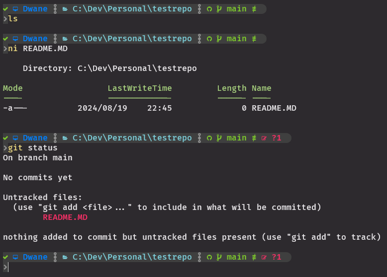

## Untracked Files:  

Files in your working directory that are not yet being tracked by Git.  
This means Git is not keeping an eye on changes to these files.  
When you create a new file in your repo directory (or copy something in), Git doesn’t automatically start tracking it but it will show you that it is untracked.  
It’s considered "untracked" until you tell Git to track it by staging and then committing.  

<kbd></kbd>

---

### Workflow Overview (So far!):
1. `git status` to check that everything is normal
2. Add new files or modify tracked files in your IDE
3. `git status` to check that the new or modified files are in the unstaged