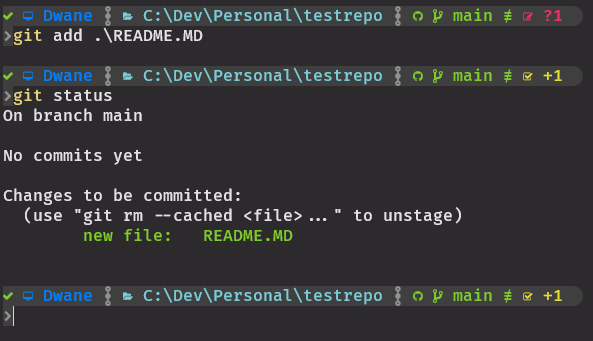
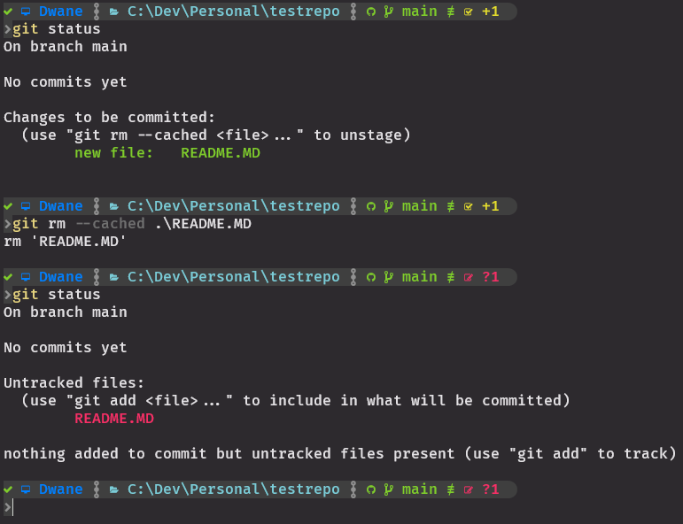

## Not Staged and Staged Files:

### Not Staged Files:

### `git diff`  

Files that are not staged could be untracked or tracked files.  
These have been changed but are not yet staged for the next commit.  
These files have been modified in your working directory, but Git is not ready to include these changes in the next commit until you explicitly stage them.  
To view differences between the changed files and most recent commit you can use `git diff` (This does not work with staged files)  

---
### Staging and Staged Files:
To move new (untracked files) or modified (tracked) files into the staging area to be tracked in the next commit we use the command:
### `git add`
- `git add <file>` to add new files or to accept all changes of a tracked file.
- `git add -p` to add modified pieces of tracked files.
- `git add .` to add everything from your current folder and lower (This is frowned upon in team situations)

After using `git add`, the file is staged, meaning it’s ready to be committed to the repo.  

<kbd></kbd>

Since `git diff` only works with unstaged files, you would now use `git diff --staged` to see changes in staged files compared to current commit.

---
### Unstaging Files:
If you notice in `git status` that one of the staged files should not be commited there is a way to unstage the file.  
### `git restore --staged <filename>` or `git reset <filename>`  
Note that if you have no commits the command is instead
#### `git rm --cached <filename>`  
This will remove the new or modified file from staging.  

<kbd></kbd>

---

### Workflow Overview (So far!):
1. `git status` to check that everything is normal
2. Add new files or modify tracked files in your IDE
3. `git status` to check that the new or modified files are in the unstaged
4. `git add <file/s>`
5. `git status` to check that everything is normal
6. If you modify the same files or others you will need to `git add` them again and check with `git status`