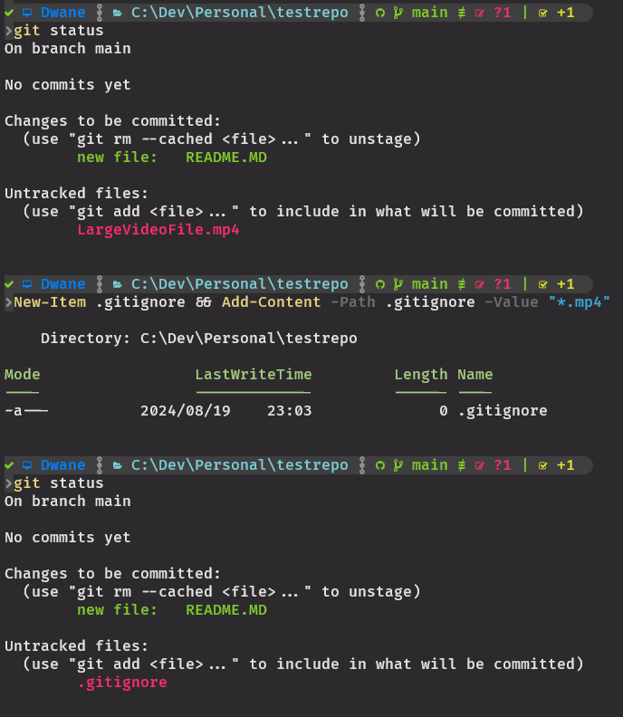

## Ignoring Files:

There could be many reasons to ignore certain files in your repo, generally it is to not keep a tracked history of unneeded or security related files:
- Dependency files
- Binary files
- Video files
- Secret related documents

You can add a file called:
### **`.gitignore`**
This file added to your repo helps Git understand what files not to track.  
It is usually placed at the highest level of the repo, but you can have multiple .gitignore files configured for different parts of your repo.  
When creating the repo on github earlier they offered a .gitignore file that could be tailored to your project.  
I recommend when starting a new repo to include their .gitignore file.  

File and folder names within the .gitignore will not be tracked, more info from [Git Documentation](https://git-scm.com/docs/gitignore) and [GitHub Templates](https://github.com/github/gitignore).  

- `*.mp4` (This will stop git from finding and mp4 files)
- `node_modules/` (This will stop git from finding and directory called node_modules)

<kbd></kbd>

---

### Workflow Overview (So far!):
1. `git status` to check that everything is normal
2. Add new files or modify tracked files in your IDE
3. `git status` to check that the new or modified files are in the unstaged
4. `git add <file/s>`
5. `git status` to check that everything is normal and no unexpected files will be added, add to .gitignore if needed
6. If you modify the same files or others you will need to `git add` them again and check with `git status`