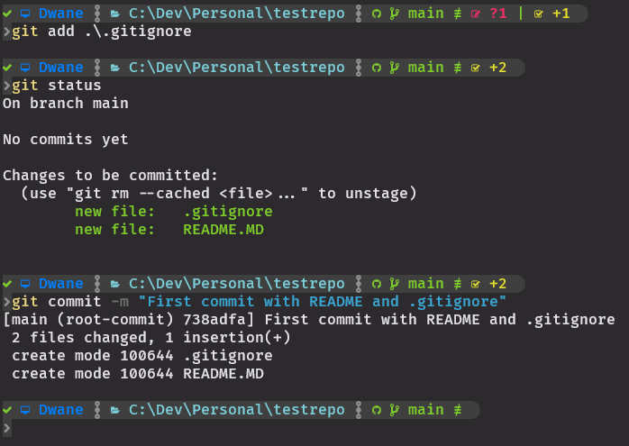
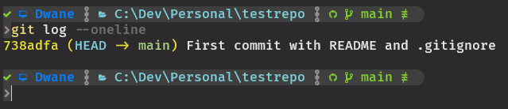

# Committing and Logging:

### Committing Files/Changes:

This is the action of saving your staged changes to the repo history. Creating a snapshot of your project at that point in time.  
The base version of the command is:
### `git commit`
Use `git commit -m "Message explaining the file changes"` to save those changes to the repo with a basic info message.  
Addittionaly you can create a more descriptive commit with a second `-m`: `git commit -m "Brief message" -m "Detailed message"`  

<kbd></kbd>  

**NOTE!** It is important to write clear and concise commit messages for yourself and other team members. [Git committing good practices](https://www.freecodecamp.org/news/how-to-write-better-git-commit-messages/).  
Commits should be "Atomic": An atomic commit is a commit that contains a single, complete, and coherent unit of work. It should be able to stand on its own, without depending on or affecting other commits. It should also have a clear and descriptive message that summarizes the changes made.

### Logs for Committed & Tracked Files:

After committing, the changes are permanently recorded in the repo with the info message, and you can always refer back to these states.  
Git will create a reference `SHA` to refer to each commit, these are unique hashes.  
We can use these SHA references (refs for short) to travel our commit history and view files at different commits, before certain modifications.  
This is great to find how issues were introduced or rectified.  
This is also a double edged sword if you commit secrets and passwords into your repo!  

### `git log`
To explore your commit history you can use the `git log` command, if your history extends off the CLI you can navigate with arrow keys and exit the logs with `q`.  
Better looking log commands:
- `git log --oneline`
- `git log --graph --oneline`  

<kbd></kbd>

---

### Workflow Overview (So far!):
1. `git status` to check that everything is normal
2. Add new files or modify tracked files in your IDE
3. `git status` to check that the new or modified files are in the unstaged
4. `git add <file/s>`
5. `git status` to check that everything is normal and no unexpected files will be added, add to .gitignore if needed
6. If you modify the same files or others you will need to `git add` them again and check with `git status`
7. `git commit -m "Message explaining the file changes"`