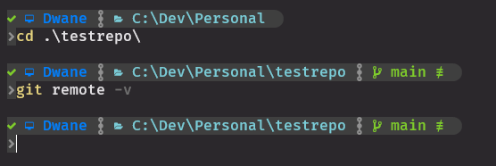
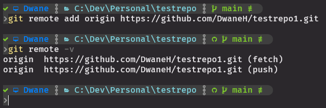
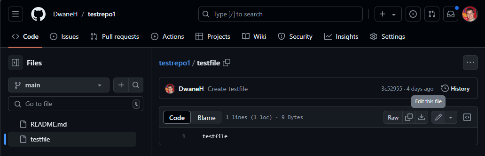
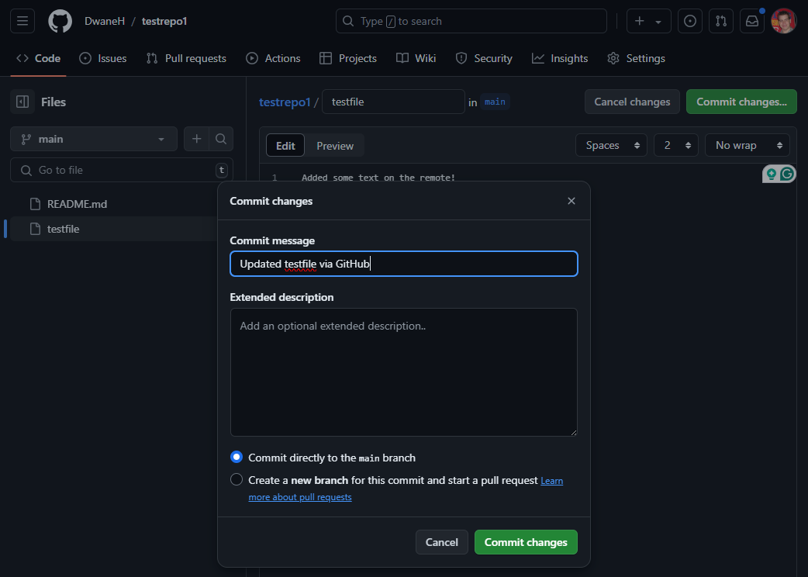
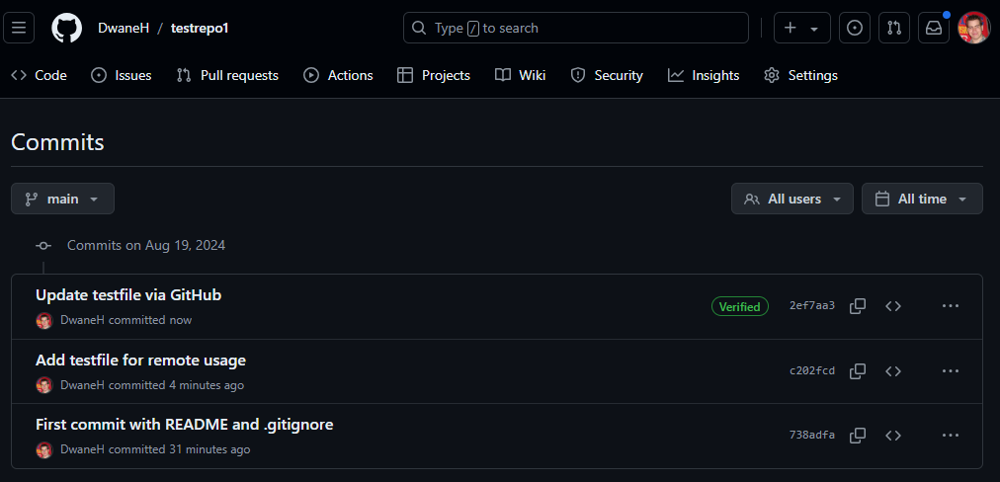
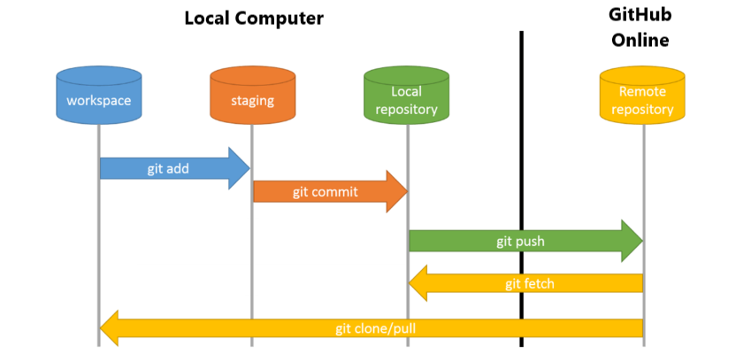

# Remotes & Setting Up a Remote:
#### `git remote`
We talked a bit about remotes in `03.CreatingRepos.md`  
A Git remote is a URL that points to a version of your repository hosted on the internet or another network.  
It allows you to collaborate with others by pushing and pulling changes to and from this remote location.
- If you `git init` a local repo the remote will be blank.
- Check what remote names are set with `git remote -v`  
<kbd></kbd>

- Add a remote with `git remote add <remote name> <remote url>` (You can add multiple remotes)  
<kbd></kbd>

- To change a remote use `git remote set-url <remote name> <remote url>`
- Usually the remote URLs are https / ssh

### Editing on a Remote: (Do this after `07.Pushing.md`)
Most online git repository providers allow editing through its web interface.  
This isn't recommended for version control, but can be useful for minor changes or quick fixes.  
Add or edit a file on your GitHub repository.  
<kbd></kbd>

<kbd></kbd>

Lets browse the commits on GitHub to confirm all the commits that exist.  
<kbd></kbd>

Now run a `git log` locally to see the commits on your computer.  
Although it was you who did the changes and the commit it only exits on the remote and not on your local!  
To get the latest changes from the remote that you or other team members have committed you need to fetch or pull changes locally.

### An overview of how certain commands work for local/remote situations:

<kbd></kbd>