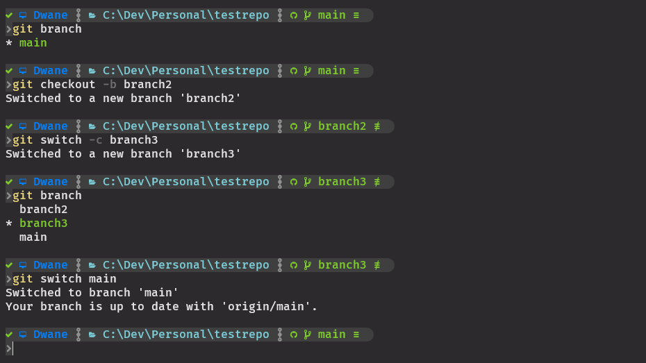
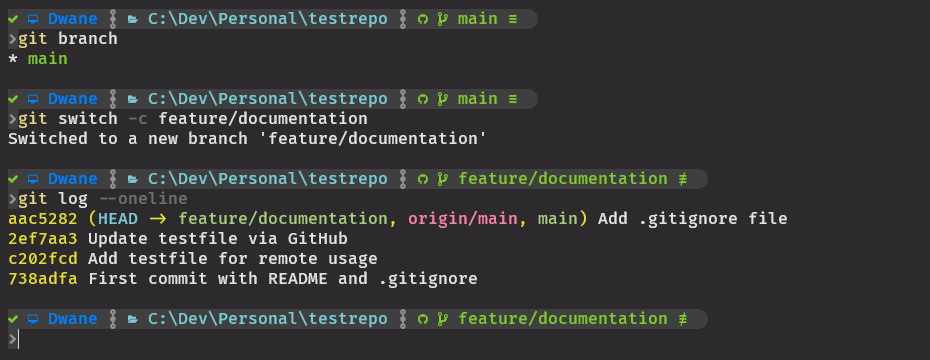
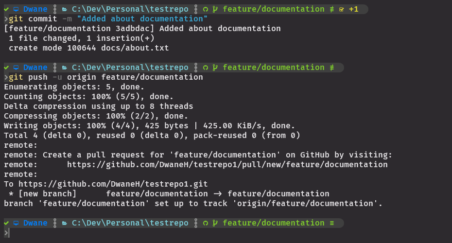

# Branching Basics:
#### `git branch`
#### `git checkout`
#### `git switch`
If we only used the `main` branch created at the start of the repo how would we test feature changes or code rewrites?  
- Branches are like separate workspaces within your project
- The `main` branch is kept as your golden standard (the up to date working version of your project)
- If you want to add a new feature or delve into some large scale project changes you create a new branch for this work
- Commands that create new branches:
  - `git branch <branch_name>` - will create a branch
  - `git checkout -b <branch_name>` - will create a branch and switch to it
  - `git switch -c <branch_name>` - will create a branch and switch to it
- Checking what branches you have:
  - `git branch` - to see all local branches
  - `git branch -a` - to see all local and all remote branches
- Switching between branches:
  - `git checkout <branch_name>`
  - `git switch <branch_name>`
- Editting branches:
  - `git branch -M <new_name>` - will change the name of the current branch
  - `git branch -D <branch_name>` - will delete the specified branch
- If you create a local branch it will not have an upstream branch for `git push`, you can set it with `git branch -u <remote> <branch>`
- Branches are often given common prefixes in team projects to help with identification:
  - `feature/<feature-name>`
  - `hotfix/<hotfix-name>`
  - `release/<release-version>`
  - eg: `git switch -c feature/dark-mode-toggle` will create a local branch called `feature/dark-mode-toggle`
- The commit/branch you were on when creating the new branch will be the base state

### Branch commands:
<kbd></kbd>

### New branches are still at the same commit:
<kbd></kbd>

### Branches made locally need to set their upstream:
<kbd></kbd>

When work on a branch has reached a stage where you are happy it can be added to `main` there are ways to merge the branch changes back in. There is a great feature avaiable in GitHub to help with this that we will go over in `09.PullRequests.md`