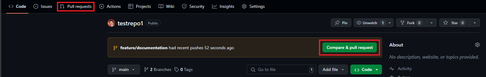
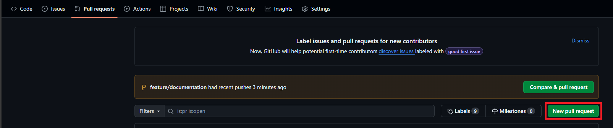
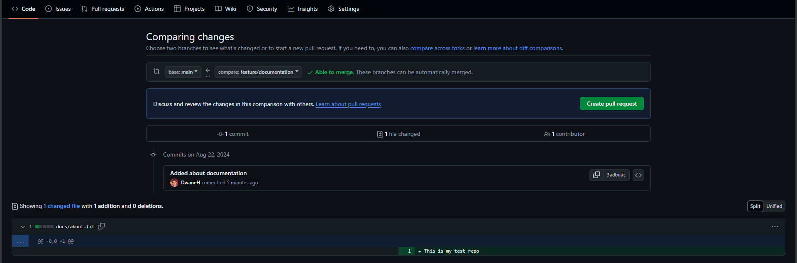
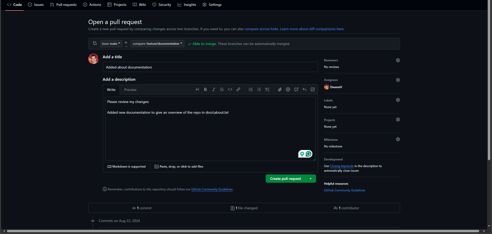
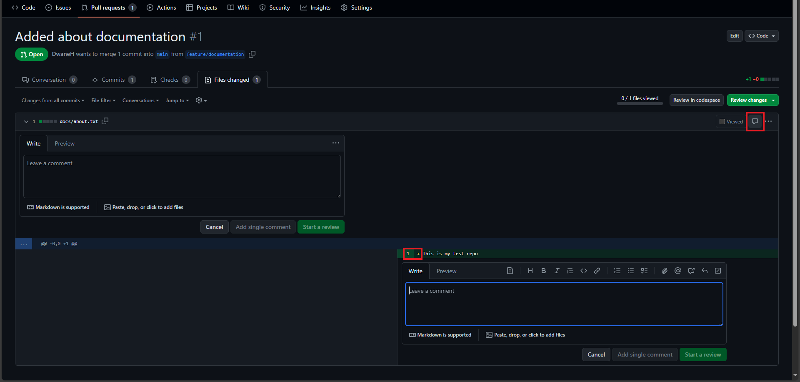
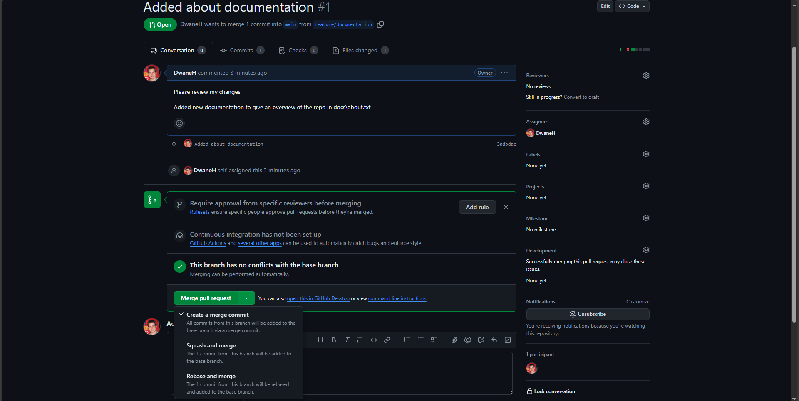
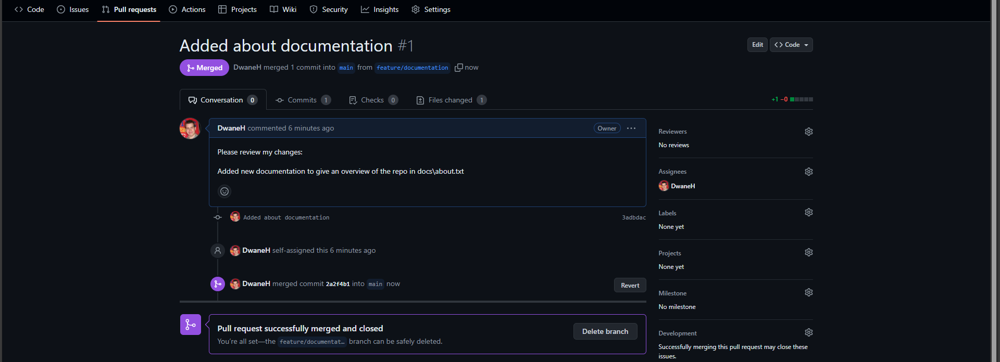

# Pull Requests (or merging with GitHub):

A `Pull Request` is a feature offered by online Git repositories.  
It is a request to merge changes from one branch into another, typically from a feature branch into the `main` branch.  
It allows others to review the changes before they are merged into the target branch, ensuring that the code is up to standard, free of errors, and in line with the project's goals.

### 1. Creating a Pull Request:
- Once complete with your feature branch ensure the latest commits have been pushed to the remote
- In the GitHub repo you can select `Pull Requests` from the top tabs (or initiate from a recent commit)  
<kbd></kbd>

- Select the top right button that says `New pull request`  
<kbd></kbd>

- In the compare changes page select the 2 branches;
  - Left branch will receive the changes (generally `main`)
  - Right branch will add its commits to the left branch  
- Once the branches are selected GitHub will show an overview of the commits and file changes
- You should double check at this point that you are happy with the changes then select `Create pull request`  
<kbd></kbd>  

### 2. Open a Pull Request:
- Additional settings are now available to give more detail to the `Pull Request`
- Provide a title and description for your pull request, clearly explain what changes you’ve made and why they are important
- Add reviewers, which could be your team members or project maintainers, and they will be notified to review your code
- Assign yourself to the Assinees so team members know the `Pull Request` belongs to you
- Labels, Projects, and Milestones are GitHub Project / GitHub Board linkable details if your team uses those
- Finally select `Create pull request` or `Create a draft pull request`  
<kbd></kbd>  

### 3. Reviews:
- `Pull requests` facilitate peer reviews, which can catch bugs, enforce coding standards, and improve overall code quality.
- Reviewers will go through your changes and may ask questions, request changes, or approve your PR.  
<kbd></kbd>  

- Reviews are a great way to get help on code or an extra set of eyes for something you may have missed, use `Draft Pull Requests` early to get this feedback
- GitHub will warn you if there are conflicting files between the branches that need attention before the `Pull Request` can be approved and merged
- Once `Approved` you can then finish the `Pull Request` by merging your branch in with 1 of 3 options.

### Merging Types and Strategy:
<kbd></kbd>  

1. `Merge pull request` will add all commits to `main` and finally create a `Merge Commit`, this keeps all history
2. `Squash and merge` will take all the commits on your branch and combine them into a single commit onto `main`, this reduces history but converts a merge into a single commit that can be rolled back if needed
3. `Rebase and merge` is a mix between the above:
   -  All of your feature branch commits are replayed onto main after its latest commit
   -  Your commits now have new SHA refs, but each commit you made along the way is still available
  
### Reviewers Approve and Complete the Merge:

- When all requests and reviews have been fixed and the reviewers are happy your `Pull Request` will be "Approved"
- Either the reviewer will finish the merge or it will come back to you to complete the merge.
- Completing the merge is the same as giving a commit message and commit description.
- Once the merge is completed the `Pull Request` updates and offers to delete the merged branch.
  - For feature branches it is recommended to delete as they have served their purpose.

<kbd></kbd>  