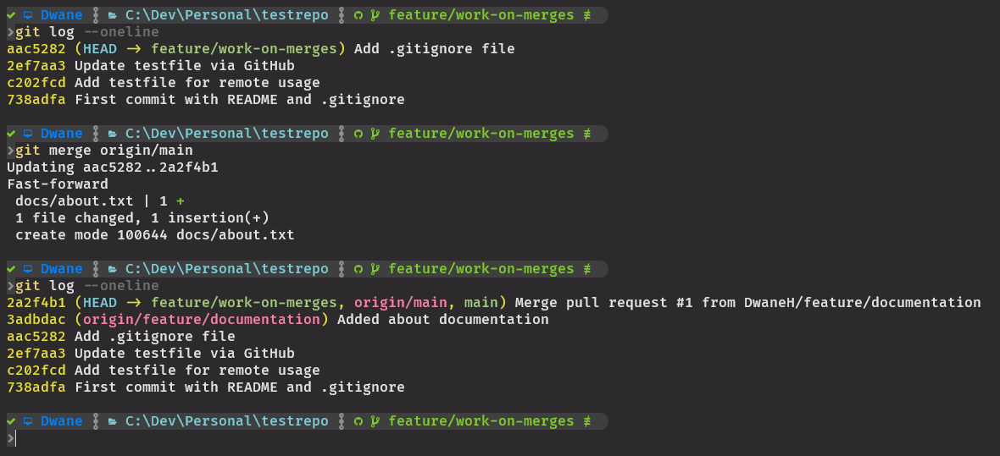

# Merging with Git:
#### `git merge`
Pull Requests are the global standard of getting feature branches merged back into the `main` branch.  
At times you instead need to merge the other way and update your feature branch with any changes on `main`.  
Maybe a different feature has completed a `Pull Request` into `main` and you want to update your branch to get the latest feature code.  
Git is able to merge branches together:
- `git switch` to the branch to receive the changes (generally your branch)
- `git status` to confirm it is your branch
- `git merge main` will bring everything from `main` and add it to your branch
- You now have everything `main` has, plus any updated code done on your branch  
<kbd></kbd>  

### Merging Types and Strategy:
- Merge `main` into your branch whenever there is a new change, you can see if `main` has changed whenever you run a `git fetch`
- You should check the changed files before using `git merge` with `git diff <branch>` or `git difftool <branch>` (Setting difftool is in `13.GitConfigs.md`)
- By default Git will attempt to run a `Fast Forward` during the `git merge`
- `Fast Forward` will occur if only 1 branch has new commits, this creates no new commits
- `Merge Commit` will occur if both branches have new commits, this creates a new commit for the changes
- `Squashing` commits from `main` to your feature branch is not required, rather use `Squashing` during Pull Requests merges
- `Rebasing` branches should **only be rebased if no one else is collaborating on the same branch as you**
- `Rebasing` changes the commits on your feature branch:
  -  Your feature branch commits are removed
  -  `main` is brought into your branch
  -  Your commits are now recommitted onto the end of `main` making it look like a brand new `Fast Forward`
  -  Your commits now have new SHA refs, other team members on your branch will not have the same SHA refs causing issues
- In the event of a `merge conflict` the merge will stop and ask you to fix the conflicting files
  - The conflicting files once changed need to be added and committed
  - `13.GitConfigs.md` helps set up VS Code as your merge conflict tool
- There will be additional details on merging in the next Meetup lesson
