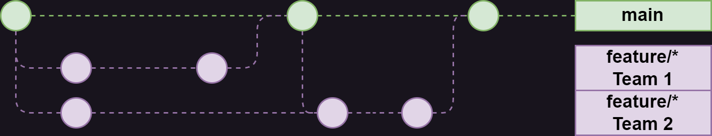
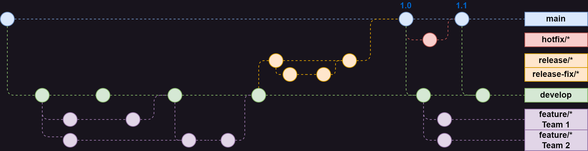

# Workflows:

Git workflows refer to the different methods and processes teams use to collaborate on software development using Git.  
Workflows are usually project or repo dependent. Selecting the correct workflow makes collaboration far more effective. 

### Centralized Workflow
**Structure:** This workflow has a single central branch.  
**Process:** Developers clone the repository, make changes, and then push those changes directly back to the remote repository.  
**Use Case:** Suitable for small teams or projects with simple requirements where direct commits to the main branch are acceptable.

### Feature Branch Workflow
**Structure:** Developers create a new branch for every feature or bug fix.  
**Process:** After completing the feature or fix, the developer merges the branch back into the main branch through a pull request.  
**Use Case:** This workflow is ideal for projects with a need for isolated development on features, reducing the risk of introducing bugs into the main codebase.

<kbd></kbd>  

### Gitflow Workflow
**Structure:** A more complex workflow with two primary branches (main and develop) and additional branches for features, releases, and hotfixes.  
**Process:**
- `feature/<feature-name>` Feature branches are created off the develop branch.
- `release/<release-version>` Release branches are created off develop when a release is ready and then merged into main after Staging/UAT.
- `hotfix/<hotfix-name>` Hotfix branches are created off main to fix issues in production.  

**Use Case:** Best suited for projects with a scheduled release cycle, or where strict management of different stages of development is required.

<kbd></kbd>  

### Forking Workflow
**Structure:** Each developer has their own fork of the main repository.  
**Process:** Developers work on their forks, and changes are submitted back to the main repository via pull requests.  
**Use Case:** Common in open-source projects, where many developers may be contributing, and maintainers want to review contributions before merging.

### Release-Based Workflow
**Structure:** Similar to Gitflow with additional branches that are maintained for different versions or releases of the software.  
**Process:**
- New development happens on the develop branch or feature branches.
- Stable versions are maintained on separate branches like release-v1.0, release-v2.0, etc.  

**Use Case:** Useful for projects that need to support multiple versions in production, allowing bug fixes to be backported to earlier versions.

### Repository Type - Mono Repo
In a mono repo all projects and their dependencies are kept within a single repository.  
Several teams manage multiple projects within the same repo with the Gitflow workflow, often using a tool to manage dependencies between the projects.  
This is used in some large organizations or projects where all code needs to be in one place, ensuring tight integration between components.

Each workflow has its strengths and is suited to different project needs and team structures. Teams should choose a workflow that aligns with their development practices, project requirements, and team size.